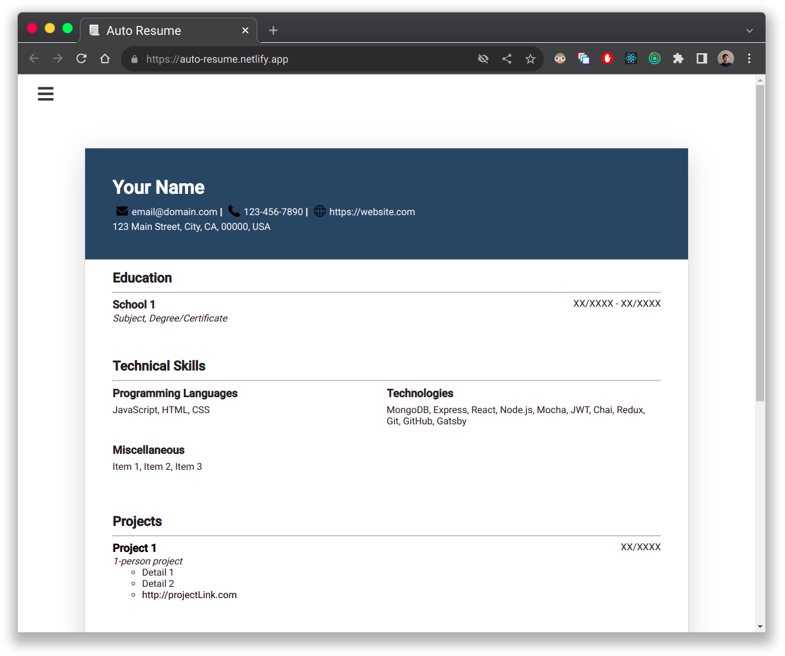
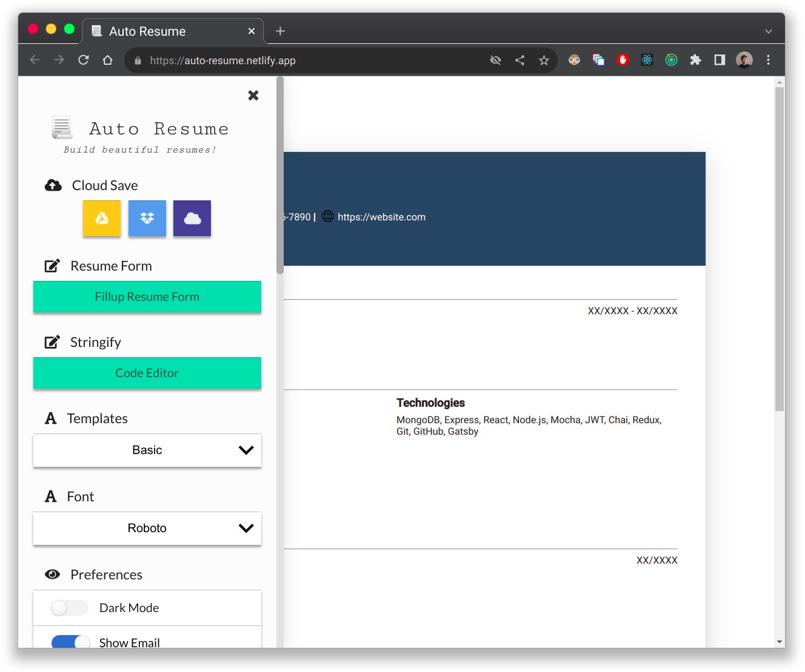
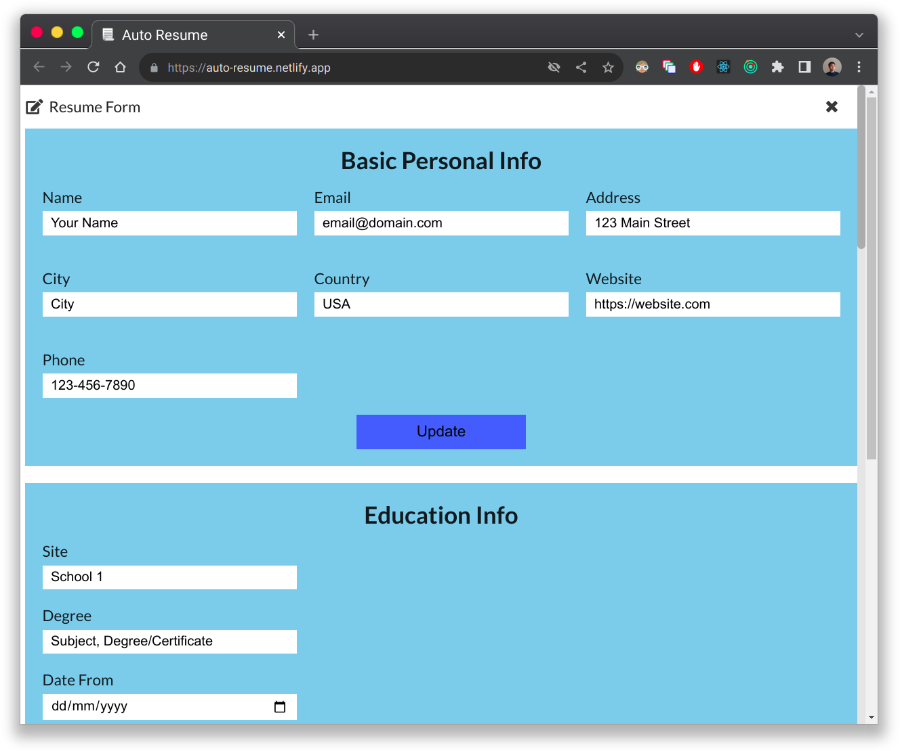

## Auto Resume

### This application help you build beautiful resumes. It is built with Reactjs.

Demo: [Click here to visit live site](https://auto-resume.netlify.app/)

### Demo Images

### Get started

In the project directory, you can run:

### `npm install`

Required to install dependencies for running locally.

### `npm start`

Runs the app in the development mode. Access it on [http://localhost:3000](http://localhost:3000).

The page will reload if you make edits. 
Keep the `Developer mode` active on your browser since runtime and lint errors may appear on the console.

### `npm test`

Launches the test runner in the interactive watch mode. 
See the section about [running tests](https://facebook.github.io/create-react-app/docs/running-tests) for more information.

### `npm run build`

Builds the app for production to the `build` folder. 
It correctly bundles React in production mode and optimizes the build for the best performance.

The build is minified and the filenames include the hashes. 
Your app is ready to be deployed!

See the section about [deployment](https://facebook.github.io/create-react-app/docs/deployment) for more information.
